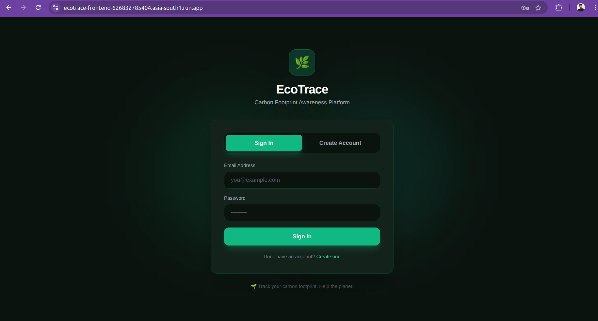
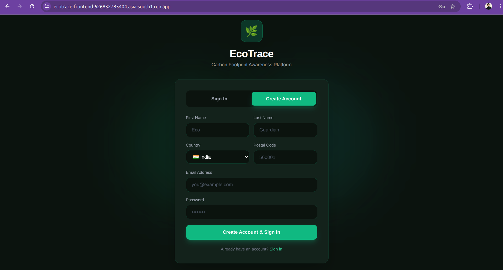
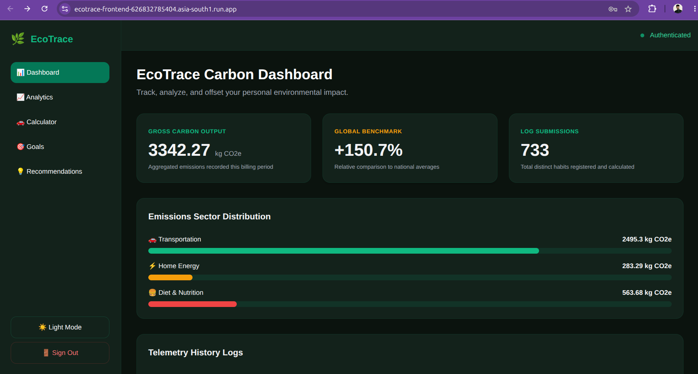
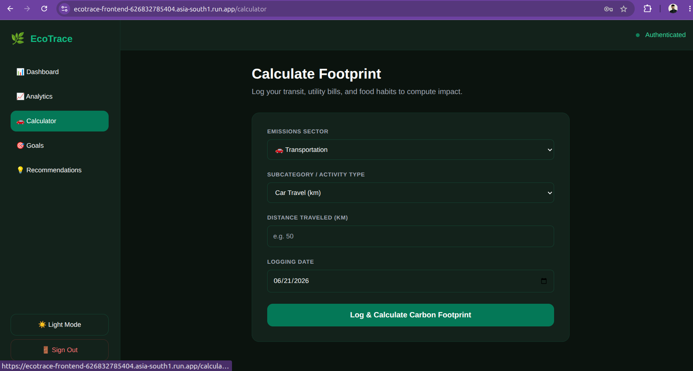
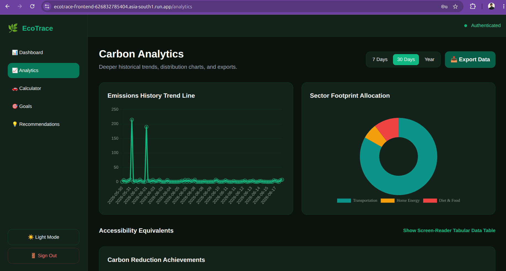
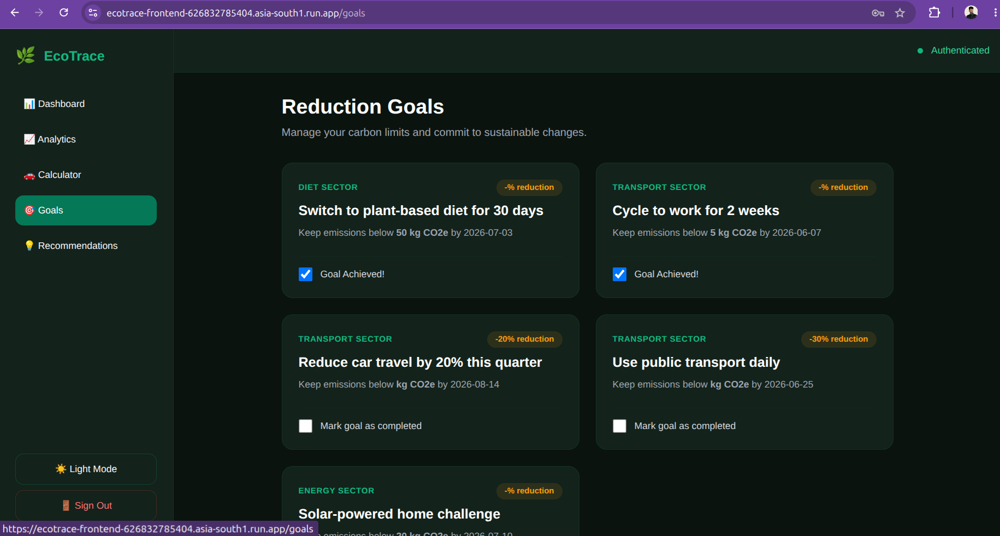
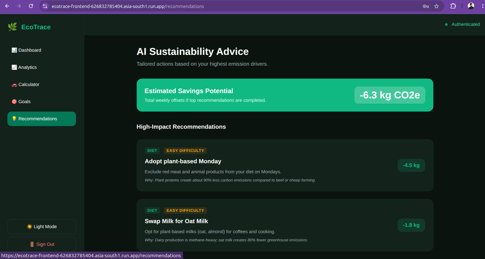

# 🌿 EcoTrace: Carbon Footprint Tracking & Awareness Platform

Welcome to EcoTrace! This monorepo hosts the complete EcoTrace system: a carbon footprint calculator, log tracker, dashboard, and goal-setting platform. It empowers individuals to calculate, visualize, and systematically reduce their daily carbon emissions.

---

## 🌐 Production & Deployment

The application is fully containerized and deployed on **Google Cloud Platform (GCP)**:

*   **Live Web App (React SPA)**: [https://ecotrace-frontend-626832785404.asia-south1.run.app](https://ecotrace-frontend-626832785404.asia-south1.run.app)
*   **Live API Backend (FastAPI)**: [https://ecotrace-api-626832785404.asia-south1.run.app](https://ecotrace-api-626832785404.asia-south1.run.app)
*   **Interactive API Docs**: [https://ecotrace-api-626832785404.asia-south1.run.app/docs](https://ecotrace-api-626832785404.asia-south1.run.app/docs)

---

## 🚀 Key Features & Visual Walkthrough

### 1. Secure Authentication & Onboarding
EcoTrace features a custom authentication system with JWT security. Users can sign in or create a new account indicating their location.
*   **Sign In**: Set up with token-based local persistence.
*   **Registration**: Dynamic onboarding supporting country select (India default) and postal code.


*Figure 1: Authentication screen for secure login.*


*Figure 2: Custom signup form for onboarding new users.*

---

### 2. Main Dashboard & Emissions Overview
The central dashboard provides an aggregate view of total carbon footprint metrics, categorized by transport, diet, and energy. It shows recent activity feeds and dynamic progress indicators.


*Figure 3: Main Dashboard showing tracked emissions and analytics summary.*

---

### 3. Detailed Carbon Calculator
An easy-to-use input panel allowing users to log actions (e.g. daily car travel, electricity bills, dietary habits). It relies on global conversion factors to calculate CO2 equivalents dynamically.


*Figure 4: Calculator page to log transportation, diet, and energy activities.*

---

### 4. Interactive Analytics & Emissions Trends
Robust visualizations charting emissions trends over weeks and months, broken down by category (Transportation, Diet, Utilities).


*Figure 5: Rich graphical charts tracking trends over time.*

---

### 5. Goal Setting & Action Plans
Users can set custom goals to reduce emissions by specific percentages or establish absolute emissions ceilings, tracking completion states in real-time.


*Figure 6: Interface to create, track, and complete carbon reduction challenges.*

---

### 6. AI Recommendations
Personalized, context-aware suggestions generated automatically to suggest low-impact changes based on logged user behavior.


*Figure 7: Tailored AI tips recommending actions to reduce footprint.*

---

## 📂 Project Structure

This monorepo handles all client interfaces, server applications, and microservices:

*   **[apps/frontend-spa](file:///home/pirate/Documents/madhu/projects/carbon_footprint_tracker/apps/frontend-spa)**: The production single-page application built using Vite, React, TypeScript, React Query, and TailwindCSS (deployed via Nginx on Cloud Run).
*   **[apps/backend-api](file:///home/pirate/Documents/madhu/projects/carbon_footprint_tracker/apps/backend-api)**: Production API built with FastAPI, SQLModel, and PostgreSQL (deployed on Cloud Run connected to GCP Cloud SQL).
*   **[scripts/seed_data.py](file:///home/pirate/Documents/madhu/projects/carbon_footprint_tracker/scripts/seed_data.py)**: Resilient concurrent seeder script using `asyncio` & `aiohttp` to seed historical user tracking data with rate-limiting retries.
*   `apps/frontend/`: Traditional SSR Next.js web application.
*   `apps/backend-tracker/`: Legacy Express tracker service.
*   `apps/backend-ml/`: Machine learning recommendation service.
*   `packages/formulas/`: Core computation packages for carbon conversion factors.
*   `packages/ui-kit/`: Shared component libraries.

---

## 🛠️ Local Development & Seeding

### 1. Prerequisites
*   **Node.js**: `v18+` or `v20+`
*   **Python**: `v3.10+` with `pip` / `venv`
*   **Database**: PostgreSQL or local SQLite instance

### 2. Live Database Seeding
To populate a fresh database with 3 months of highly realistic, historical data for multiple test users, run the seeder script.
The seeder handles rate limit limits automatically with exponential retry backoff:

```bash
# Set up virtual environment and execute the seeder
cd apps/backend-api
python3 -m venv venv
./venv/bin/pip install aiohttp
cd ../..
./apps/backend-api/venv/bin/python scripts/seed_data.py
```

### 3. Running Backend Locally
To run the FastAPI backend server locally:

```bash
cd apps/backend-api
./venv/bin/pip install -r requirements.txt
./venv/bin/uvicorn app.main:app --reload --port 8000
```

### 4. Running Frontend Locally
To start the React/Vite development server:

```bash
cd apps/frontend-spa
npm install
npm run dev
```
Open [http://localhost:5173](http://localhost:5173) in your browser.
